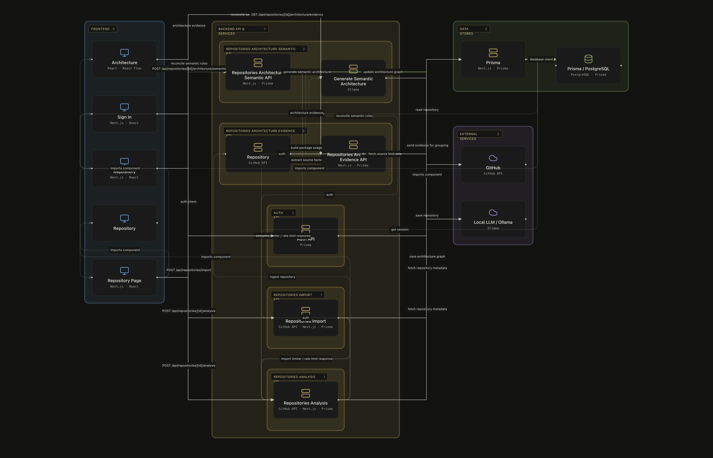

# code-analysis

Analyzes repositories to generate semantic architecture views from code data.

     

## Overview

This system processes GitHub repositories to create visual architecture representations. Users import repositories via the frontend, which triggers backend analysis services to extract code structure and semantic relationships. The generated architecture evidence is then displayed through interactive UI components. The system uses Prisma ORM for database interactions and local LLM models for semantic analysis, with authentication handled through dedicated API endpoints.

## Architecture

<p align="center">
  
</p>

## How It Works

1. **User import and analysis workflow** — User imports repository via frontend, triggers backend import API, processes repository data through analysis API, and displays results on repository page.
2. **Architecture generation workflow** — Generates semantic architecture from repository data using LLM, processes evidence, and updates UI with architecture views.
3. **Repository import and analysis workflow** — Imports GitHub repository metadata, processes code data through analysis services, and saves architecture results to database.
4. **Repository view workflow** — Fetches repository analysis data, generates architecture evidence, and displays summary and detailed views.

## Implementation Highlights

### Prisma / PostgreSQL

Manages database schema and PostgreSQL interactions

<sub>apps/web/src/app/api/repositories/[id]/analysis/route.ts:102–102</sub>

```typescript
await prisma.repository.findUnique({ where: { id }, include: { architecture: true } })
```

### GitHub API

Provides access to GitHub repository metadata and code

<sub>apps/web/src/lib/repository-analysis.ts:122–122</sub>

```typescript
await get(`/git/blobs/${entry.sha}`)
```

### Local LLM / Ollama

Provides access to local LLM models for semantic analysis

<sub>apps/web/src/lib/ai/generate-semantic-architecture.ts:26–32</sub>

```typescript
await fetcher(`${(process.env.OLLAMA_BASE_URL ?? 'http://localhost:11434').replace(/\/$/, '')}/api/chat`, {
        method: 'POST', headers: { 'Content-Type': 'application/json' }, signal: AbortSignal.timeout(300_000),
        body: JSON.stringify({ model: process.env.OLLAMA_MODEL ?? 'qwen3:8b', stream: false, think: false,
          format: z.toJSONSchema(modelSchema), options: { temperature: 0, num_ctx: 32768, num_predict: 4096 },
          messages: [{ role: 'system', content: semanticSystemPrompt }, { role: 'user', content: buildSemanticPrompt(compact) }],
        }),
      })
```

### Auth API

Handles user authentication and session management

<sub>apps/web/src/app/api/auth/[...all]/route.ts:3–3</sub>

```typescript
import { auth } from "@/lib/auth";
```

## Tech Stack

| Layer | Technologies |
| --- | --- |
| Languages | TypeScript, JavaScript, SQL, CSS |
| Frameworks | Next.js, React, TypeScript |
| Data | PostgreSQL, Prisma |
| Styling | Tailwind CSS |

## Project Structure

```text
.
├── apps/
├── apps/web/
└── supabase/
```

## Getting Started

```bash
cd apps/web
npm install
npm run dev
```
